# 投资组合管理系统功能流程图

## 1. 股票买卖流程

### 买入股票流程

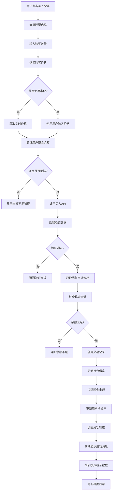

### 卖出股票流程

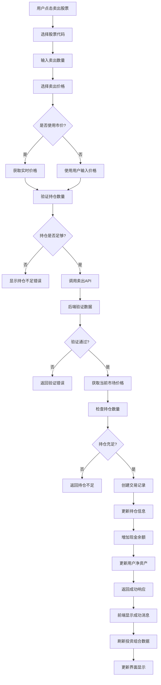

## 2. 基金买卖流程

### 买入基金流程

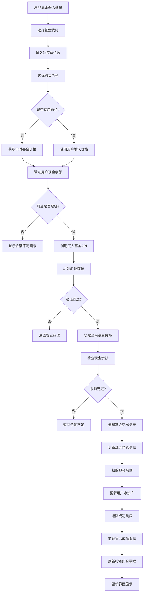

### 卖出基金流程

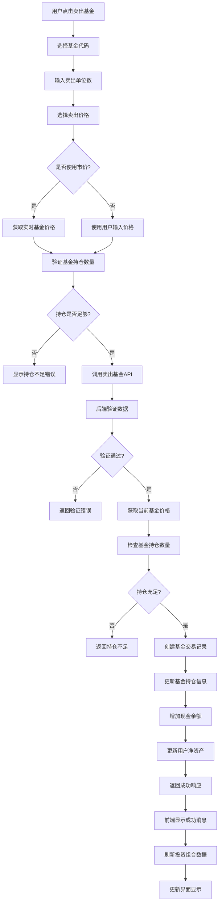

## 3. 现金管理流程

### 存款流程

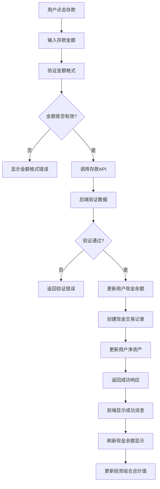

### 取款流程

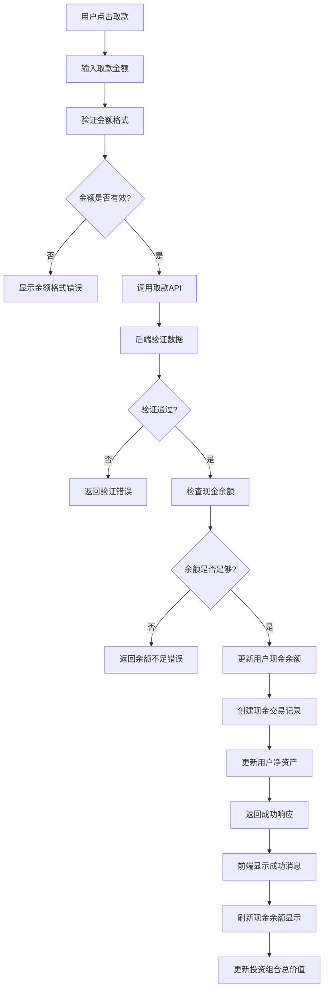

## 4. AI预测流程

### 启动预测流程

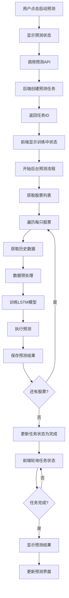

### 预测结果查看流程

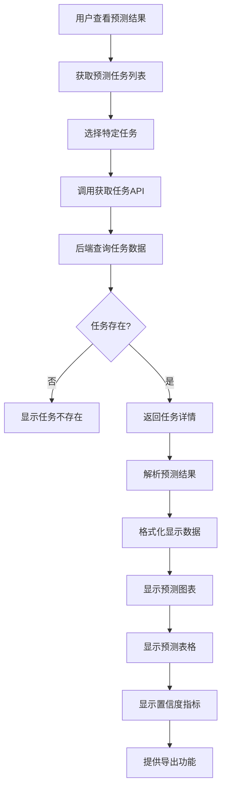

## 5. AI聊天流程

### 智能投资建议流程

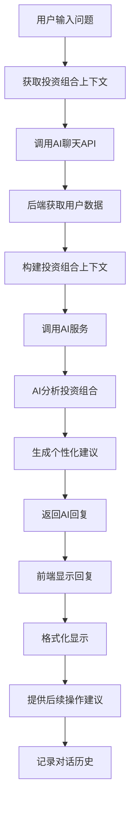

## 6. 投资组合查看流程

### 投资组合数据加载流程

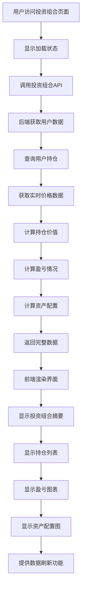

### 实时数据更新流程

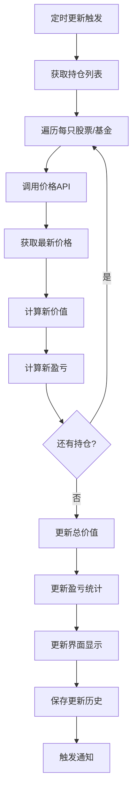

## 7. 交易历史查看流程

### 交易记录查询流程

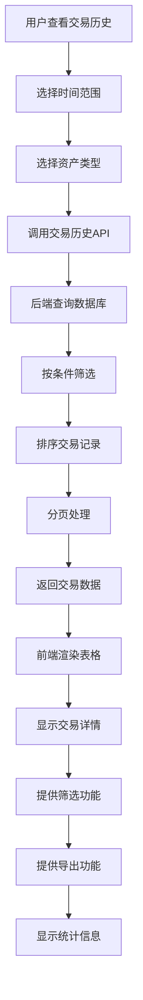

## 8. 资产配置分析流程

### 资产配置计算流程

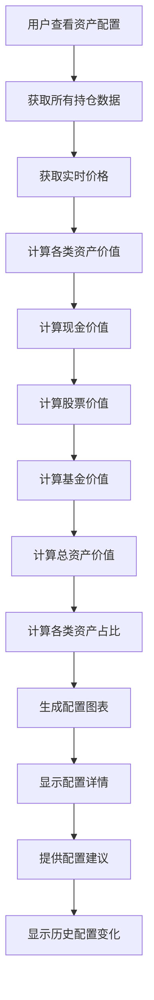

## 9. 市场数据查看流程

### 实时市场数据流程

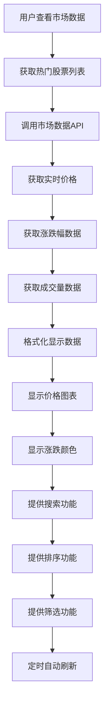

## 10. 错误处理流程

### 通用错误处理流程

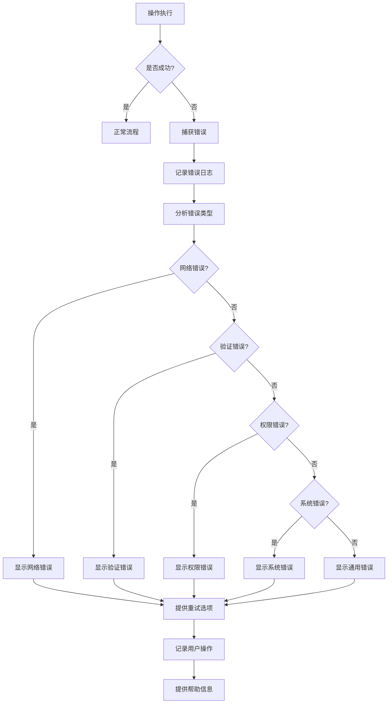

## 11. 数据同步流程

### 前后端数据同步流程

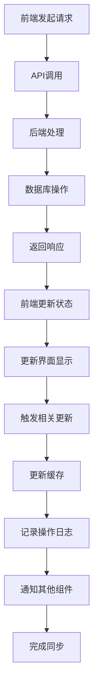

## 12. 用户认证流程

### 用户登录流程

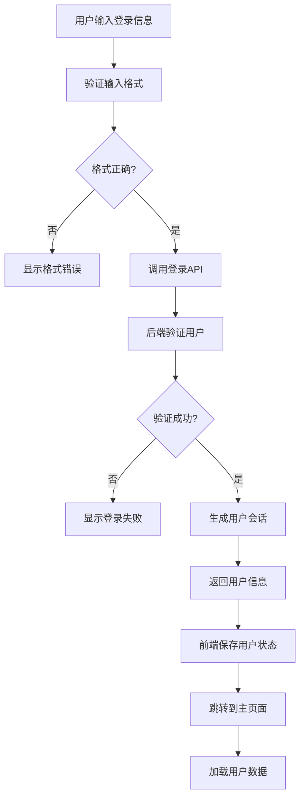

## 13. 系统监控流程

### 性能监控流程

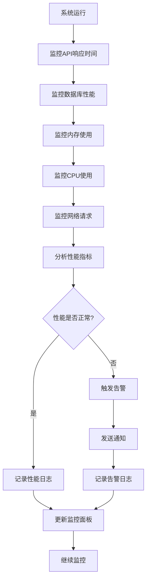

## 14. 数据备份流程

### 数据库备份流程

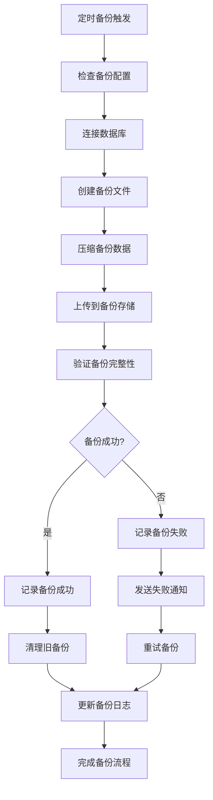

## 15. 部署流程

### 系统部署流程

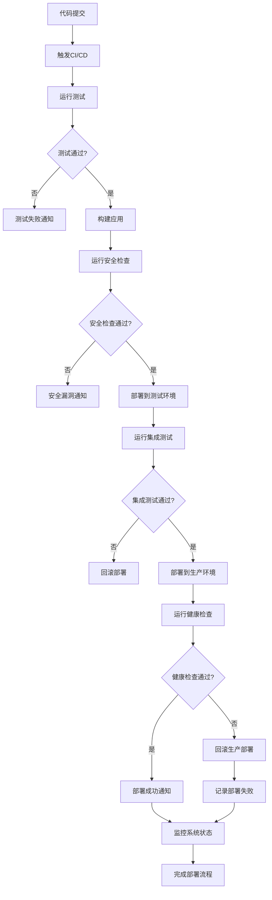

这些流程图详细描述了系统中各个功能的完整执行流程，包括正常流程、异常处理和错误恢复机制。每个流程都考虑了用户体验、系统性能和错误处理等方面。 