# Portfolio Management System Flowcharts

## 1. Stock Trading Flow

### Buy Stock Flow

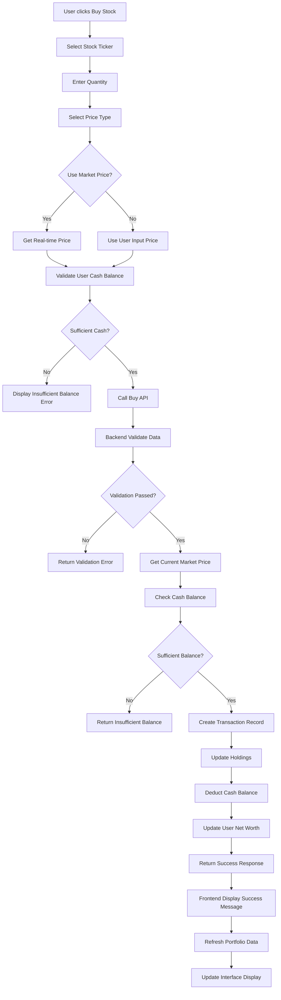

### Sell Stock Flow

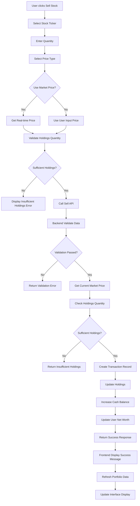

## 2. Fund Trading Flow

### Buy Fund Flow

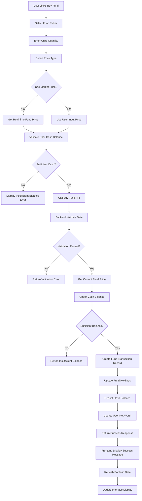

### Sell Fund Flow

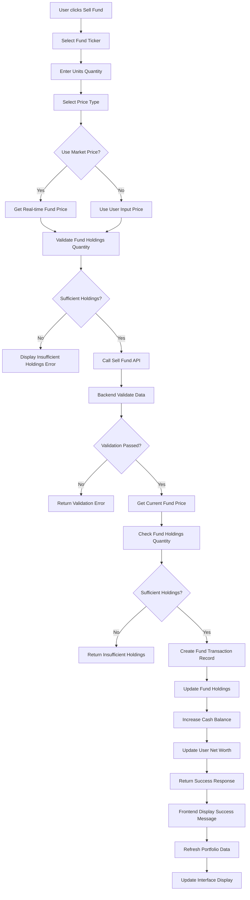

## 3. Cash Management Flow

### Deposit Flow

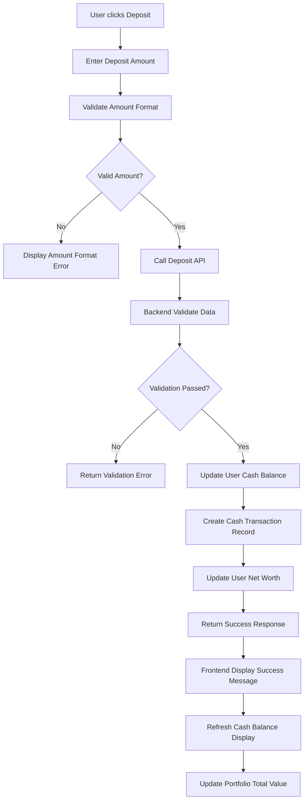

### Withdraw Flow

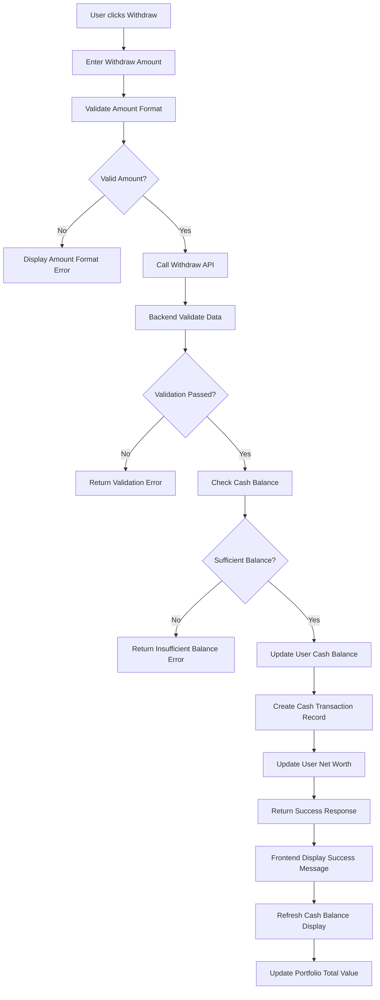

## 4. AI Prediction Flow

### Start Prediction Flow

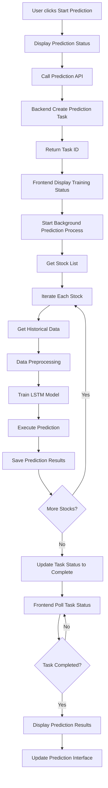

### View Prediction Results Flow

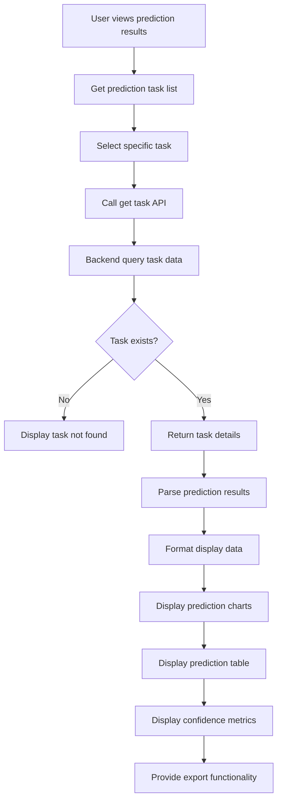

## 5. AI Chat Flow

### Smart Investment Advice Flow

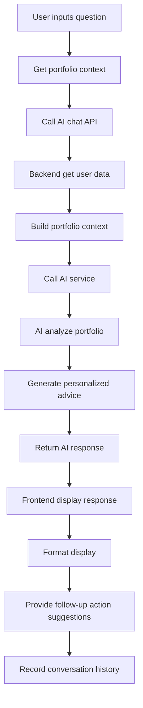

## 6. Portfolio View Flow

### Portfolio Data Loading Flow

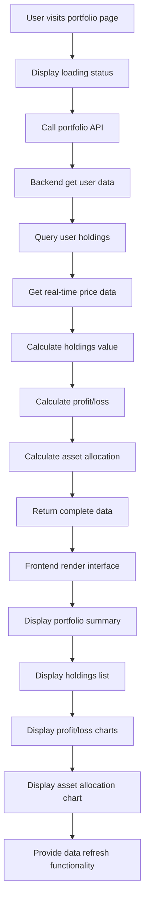

### Real-time Data Update Flow

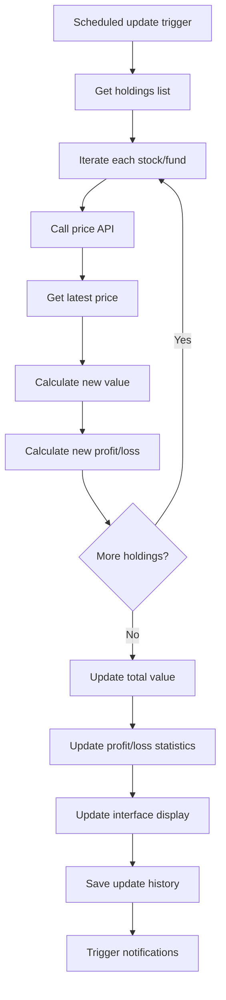

## 7. Transaction History View Flow

### Transaction Record Query Flow

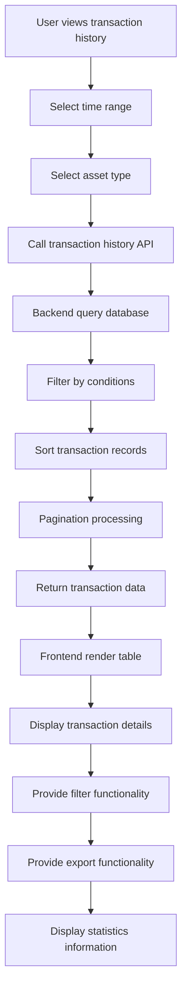

## 8. Asset Allocation Analysis Flow

### Asset Allocation Calculation Flow

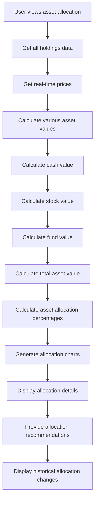

## 9. Market Data View Flow

### Real-time Market Data Flow

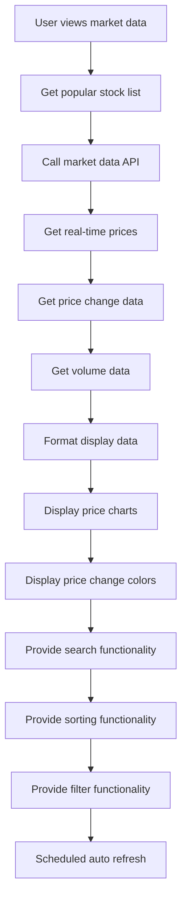

## 10. Error Handling Flow

### General Error Handling Flow

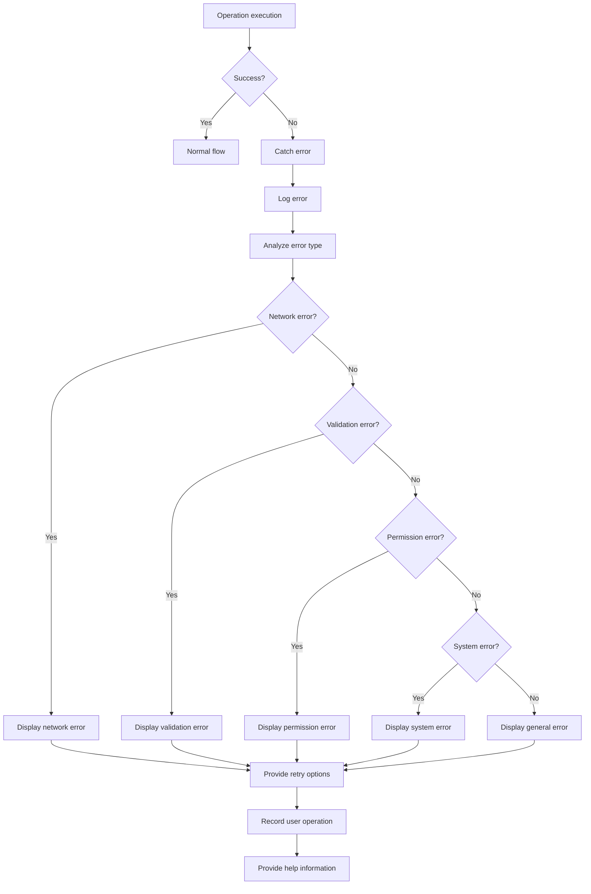

## 11. Data Synchronization Flow

### Frontend-Backend Data Sync Flow

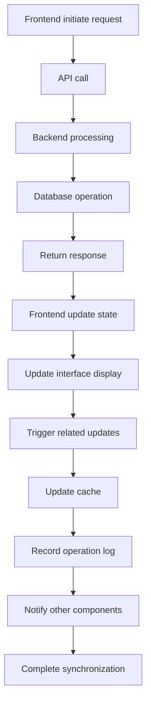

## 12. User Authentication Flow

### User Login Flow

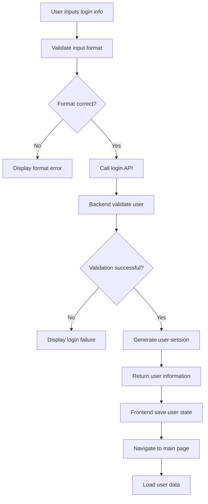

## 13. System Monitoring Flow

### Performance Monitoring Flow

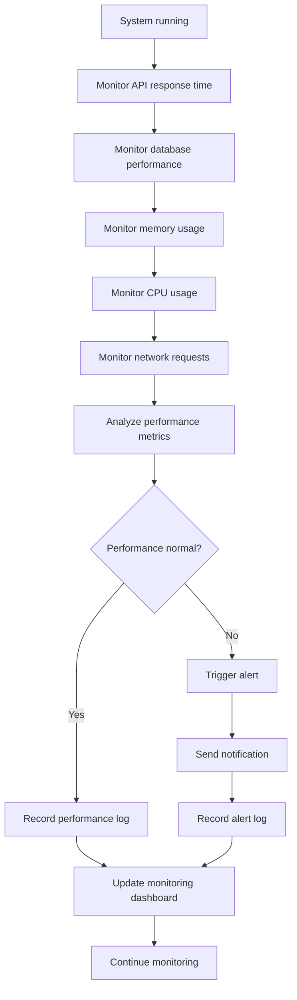

## 14. Data Backup Flow

### Database Backup Flow

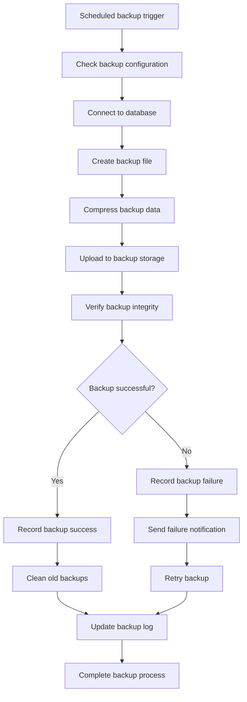

## 15. Deployment Flow

### System Deployment Flow

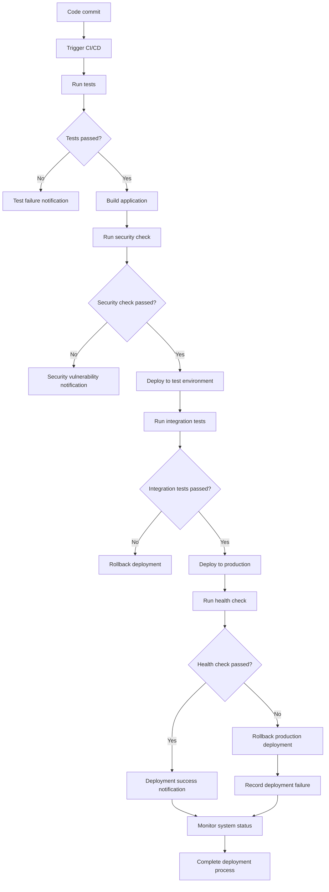

These flowcharts detail the complete execution flow of various functions in the system, including normal processes, exception handling, and error recovery mechanisms. Each flow considers user experience, system performance, and error handling aspects. 