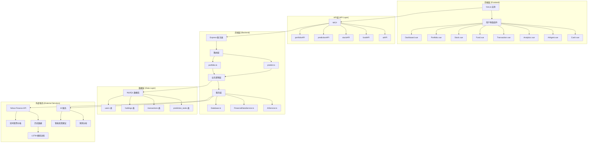
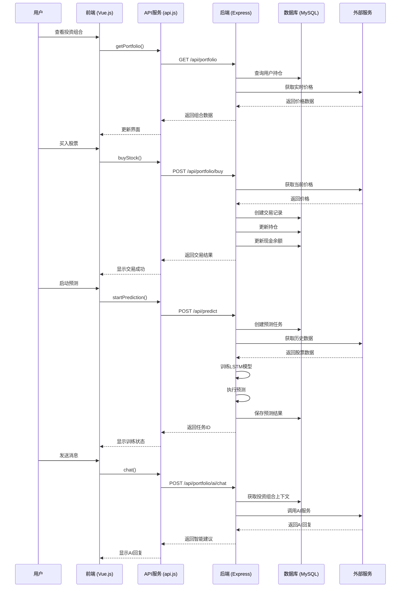
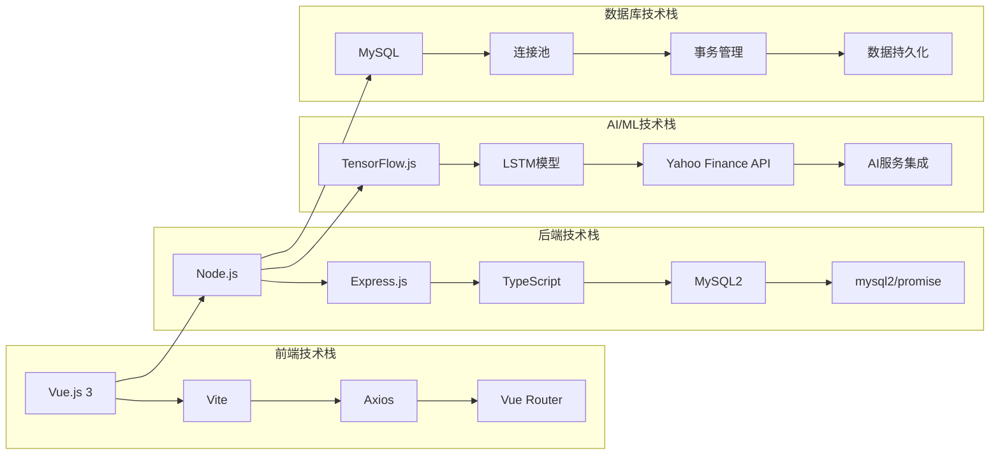
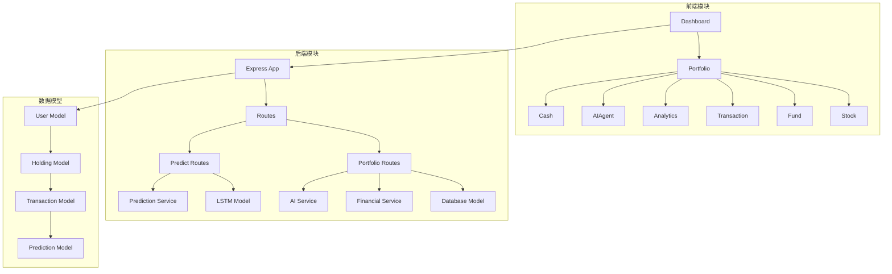
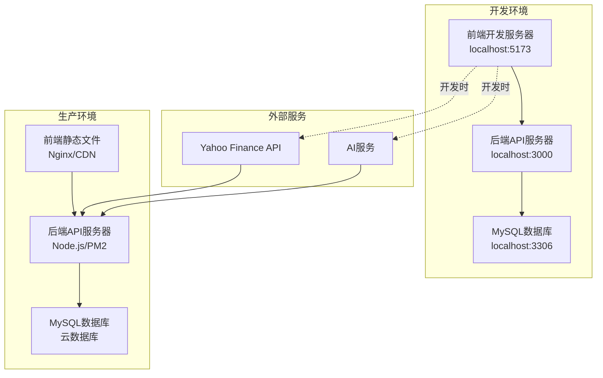

# 投资组合管理系统架构图

## 系统整体架构

## 详细数据流图

## 技术栈架构

## 模块依赖关系

## 部署架构

## 关键特性说明

### 1. 实时数据流
- **股票价格**: 通过Yahoo Finance API实时获取
- **持仓价值**: 动态计算基于当前价格
- **盈亏分析**: 实时更新投资组合盈亏

### 2. AI预测系统
- **LSTM模型**: 使用TensorFlow.js训练
- **历史数据**: 从Yahoo Finance获取3个月数据
- **预测结果**: 存储到数据库供前端查询

### 3. 智能投资建议
- **AI聊天**: 集成AI服务提供投资建议
- **投资组合分析**: 基于用户持仓提供个性化建议

### 4. 数据一致性
- **事务管理**: MySQL事务确保数据一致性
- **连接池**: 优化数据库连接性能
- **错误处理**: 完善的错误处理机制

## 性能优化

1. **前端优化**: Vue.js虚拟DOM，组件懒加载
2. **后端优化**: 连接池，缓存机制
3. **数据库优化**: 索引优化，查询优化
4. **网络优化**: HTTP/2，压缩传输

## 安全考虑

1. **输入验证**: 前后端双重验证
2. **SQL注入防护**: 参数化查询
3. **CORS配置**: 跨域请求控制
4. **环境变量**: 敏感信息配置化 
