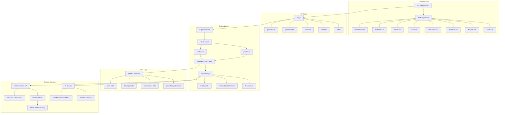
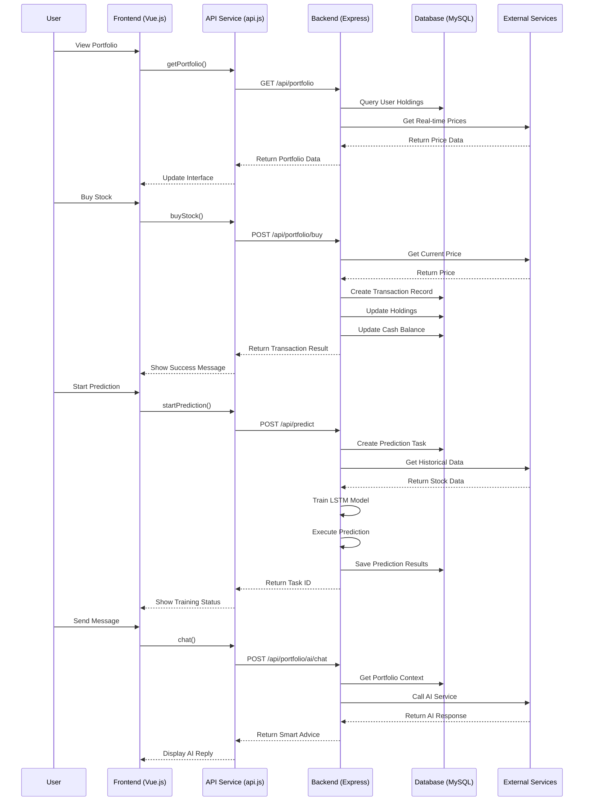
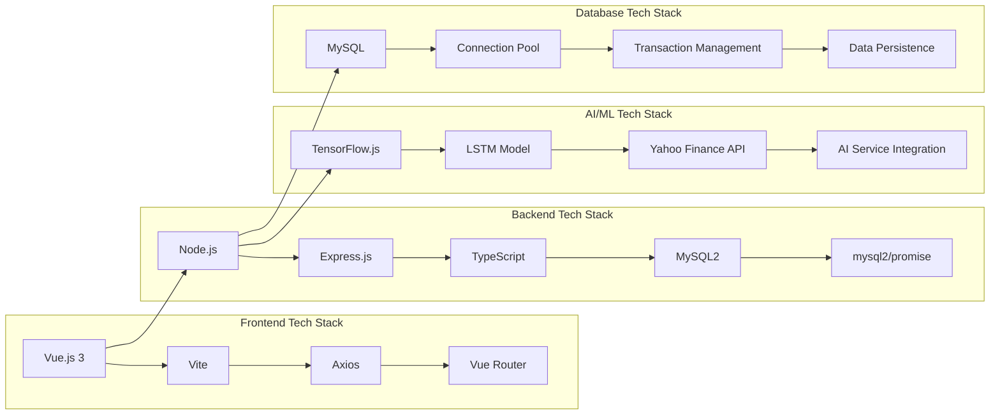
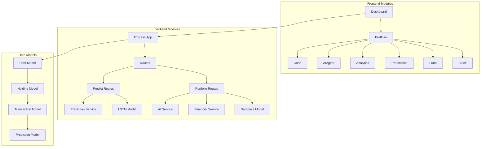
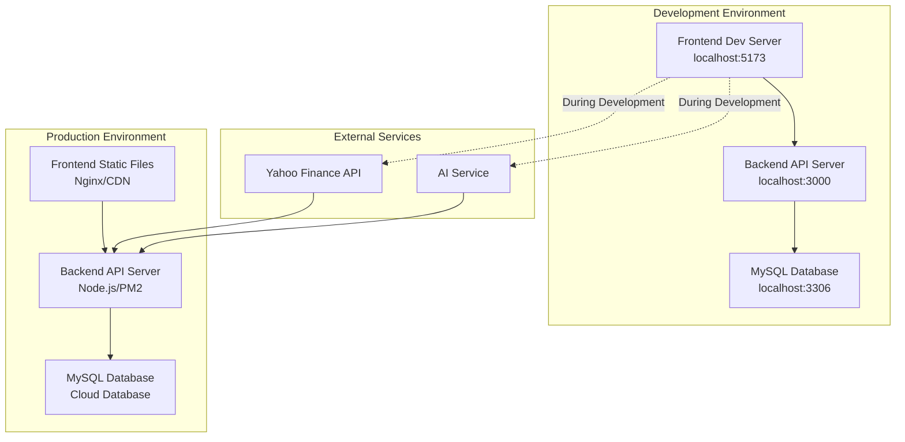

# Portfolio Management System Architecture

## System Overall Architecture

## 详细数据流图

## Technology Stack Architecture

## Module Dependencies

## Deployment Architecture

## Key Features

### 1. Real-time Data Flow
- **Stock Prices**: Real-time fetching via Yahoo Finance API
- **Portfolio Value**: Dynamic calculation based on current prices
- **Profit/Loss Analysis**: Real-time portfolio P&L updates

### 2. AI Prediction System
- **LSTM Model**: Training using TensorFlow.js
- **Historical Data**: 3-month data from Yahoo Finance
- **Prediction Results**: Stored in database for frontend queries

### 3. Smart Investment Advice
- **AI Chat**: Integrated AI service for investment advice
- **Portfolio Analysis**: Personalized recommendations based on user holdings

### 4. Data Consistency
- **Transaction Management**: MySQL transactions ensure data consistency
- **Connection Pooling**: Optimized database connection performance
- **Error Handling**: Comprehensive error handling mechanisms

## Performance Optimization

1. **Frontend Optimization**: Vue.js virtual DOM, component lazy loading
2. **Backend Optimization**: Connection pooling, caching mechanisms
3. **Database Optimization**: Index optimization, query optimization
4. **Network Optimization**: HTTP/2, compression transmission

## Security Considerations

1. **Input Validation**: Frontend and backend dual validation
2. **SQL Injection Protection**: Parameterized queries
3. **CORS Configuration**: Cross-origin request control
4. **Environment Variables**: Sensitive information configuration 
